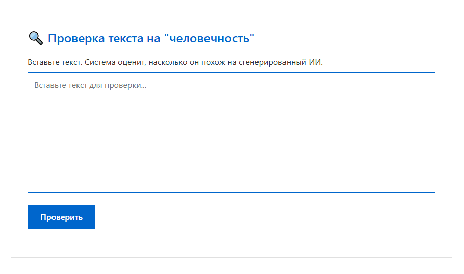
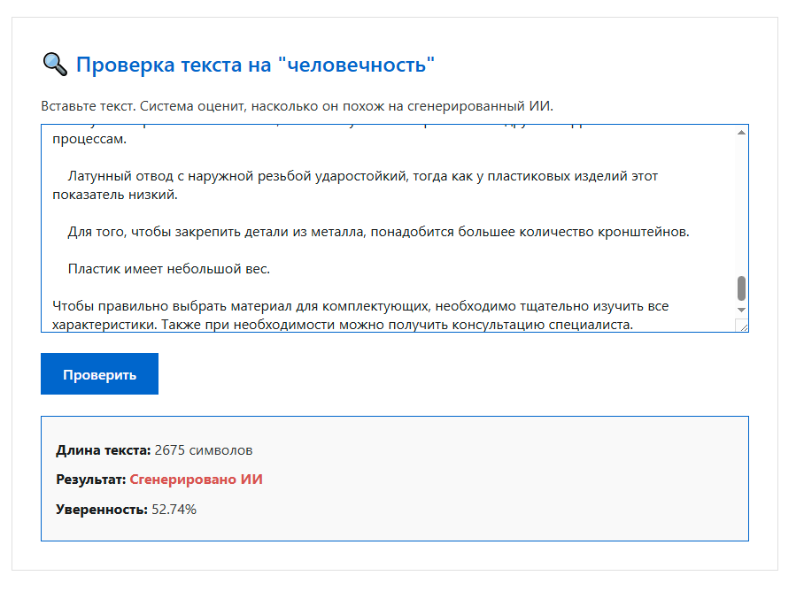

# AI Detector — Проверка текста на "человечность"

Локальный микросервис для анализа текстов на предмет генерации ИИ. Работает полностью автономно, без передачи данных в интернет.

## Особенности
- Проверка на русском языке
- Модель: `cointegrated/rubert-tiny`
- Интерфейс в браузере
- Подходит для SEO, копирайтинга, контент-анализа

## Требования
- Docker
- Python 3.10+ (для локальной разработки)

## Запуск
```bash
docker build -t ai-detector .
docker run -p 8000:8000 ai-detector


